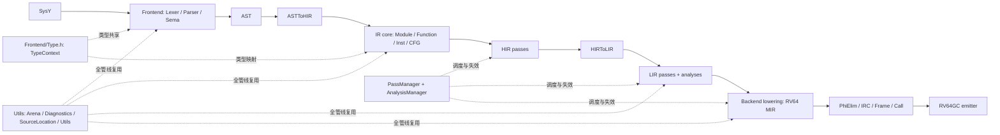
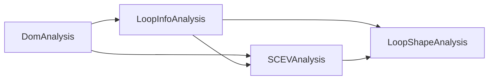
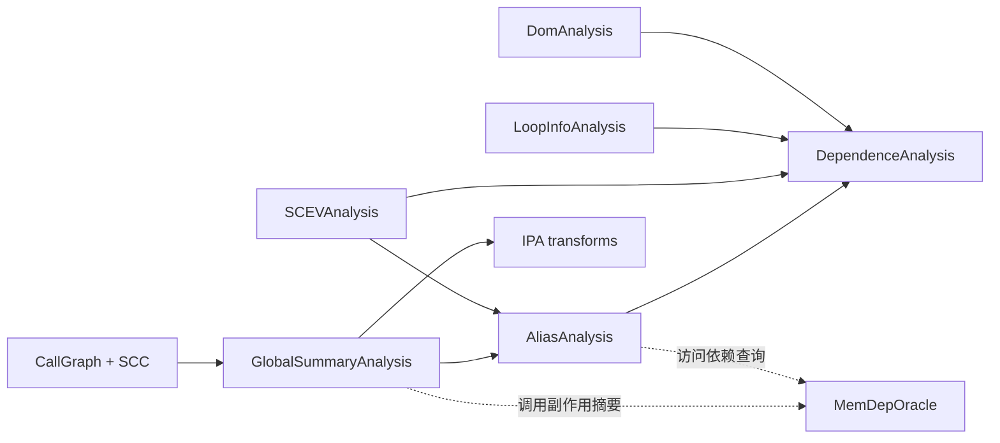
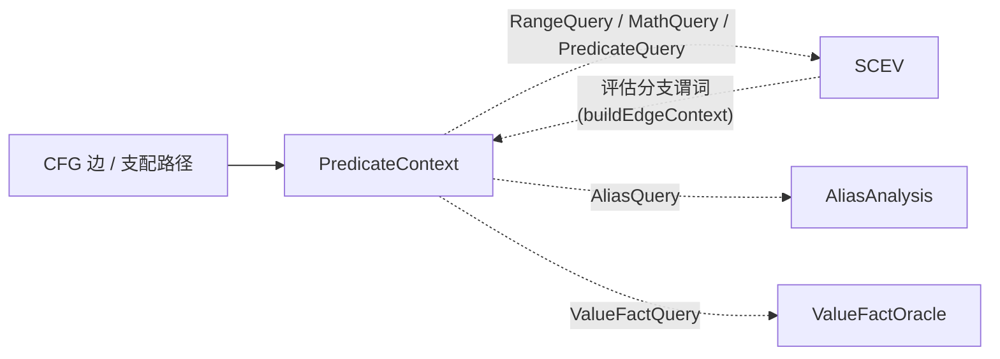
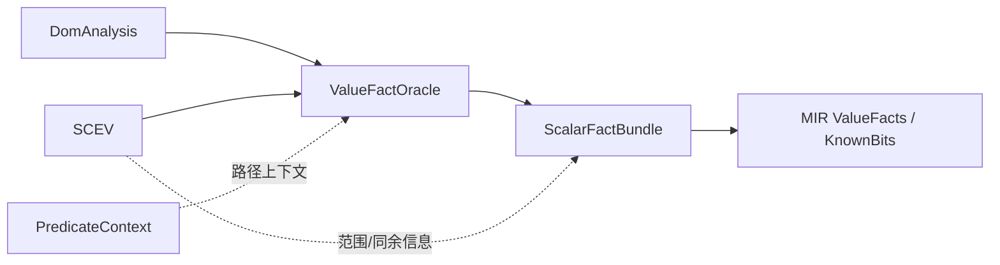

# SVM - Supportless Vectorization Machine

> Yet Another Supportless Vectorization Machine for SysY. \
~~又是一个不支持向量化的SysY编译器。~~

面向 **SysY** 教学语言的 RV64GC 编译器，支持标量优化，确实不支持向量化。实现了完整的编译器中端优化管线（SSA、支配分析、别名分析、过程间摘要、SCEV、依赖分析、循环变换）和 IRC 图着色寄存器分配。

## 0. 如何运行

### 环境要求

- CMake 3.16 或更高版本。
- `clang` / `clang++`。`CMakeLists.txt` 会显式选择 Clang，并以 C++17、`-fno-rtti`、`-fno-exceptions` 和较严格的警告选项构建。
- Ninja 是推荐的构建工具，但不是必需的。
- 编译器输出 RV64GC 汇编；运行汇编需要一个相应的交叉工具链或模拟器（这不属于本仓库的构建步骤）。

### i. 使用 CMake + Ninja（推荐）

Release 构建：

```bash
cmake -S . -B build -G Ninja -DCMAKE_BUILD_TYPE=Release
ninja -C build
```

开发使用默认的 Debug 配置，会开启各种IR验证（编译速度慢）：

```bash
cmake -S . -B build -G Ninja
ninja -C build
```

生成的可执行文件是 `build/svm`，静态库是 `build/libsvm_core.a`。

### ii. 纯 CMake

```bash
cmake -S . -B build -DCMAKE_BUILD_TYPE=Release
cmake --build build --parallel
```

### iii. 使用命令编译

> 警告：不会并行编译，通常需要几分钟。

```bash
clang++ --std=c++17 -O2 -lm \
        $(find src -name "*.cpp") \
        -I. \
        -Isrc \
        -Isrc/Utils \
        -Isrc/Frontend \
        -Isrc/IR \
        -Isrc/HIR \
        -Isrc/LIR \
        -Isrc/Backend \
        -o compiler
```

### 命令行与中间结果

基本用法：

```text
svm [options] <input-file.sy>
```

常用选项如下：

| 选项 | 输出或作用 |
| --- | --- |
| `-emit-tokens` | 输出词法单元 |
| `-emit-ast` | 输出 AST |
| `-emit-hir` | 输出结构化 HIR |
| `-emit-lir-pre` | 输出 HIRToLIR 后、优化前的 LLVM 风格文本 |
| `-emit-lir` | 输出优化后的 LLVM 风格文本 |
| `-S` / `-emit-asm` | 输出 RV64GC 汇编（默认） |
| `-O0` | 关闭优化管线，仍执行必要的 lowering 和后端 |
| `-O1` | 开启优化管线（默认） |
| `-time` | 打印 Pass 计时统计 |
| `-o <file>` | 指定输出文件 |
| `-h` / `-help` | 显示帮助 |

`-emit-lir*` 输出的是可运行 LLVM IR，方便使用 lli/lla 或参考编译器对拍。但内部对象**不是**完整的 LLVM IR。

## 1. 编译器架构

### 1.1 数据流


### 1.2 两条管线安排

**O0 未优化路径**：

```text
Lexer
 -> Parser / Sema / ASTToHIR
 -> HIRToLIR
 -> LowerArrayIndex
 -> LowerToRV64
 -> EliminatePhis
 -> IRCAlloc
 -> ComputeFrameLayout
 -> FixupStackOffsets
 -> LowerCallShuffles
 -> EmitAssembly
```

**O1 默认优化路径**：

```text
HIR 规范化与循环识别
 -> HIRToLIR
 -> CFG / Mem2Reg / 函数级 IPA
 -> 标量清理（若干轮）
 -> LoopSimplify / LCSSA / IndVarSimp
 -> Unswitch / RepeatReduction / Interchange
 -> UnrollAndJam / LoopUnroll
 -> LowerArrayIndex
 -> 标量地址清理 / LSR / LCSSA 消除
 -> 短路与 switch 规范化 / IfConversion / GlobalMerge
 -> LowerToRV64
 -> 机器级标量优化
 -> PhiElim / IRC / 栈帧与调用定型
 -> EmitAssembly
```

### 1.3 各阶段主要内容

1. **词法与语法**：Lexer 将源字符映射为带 `SourceLocation` 的 Token；Parser 构造带源码范围的 AST，并在语法错误处进行部分错误恢复（插入字面量 0 节点）。
2. **语义分析**：Sema 建立作用域和符号绑定，检查类型、数组维度、函数签名、常量表达式和隐式数值转换，同时注入运行时库函数原型。
3. **ASTToHIR**：把语言语义映射到共享 `Inst` 表示。HIR 保留 `if`、`while` 等结构化控制流。
4. **HIR 优化**：在结构化表示仍然存在时做局部合并、尾递归转换、循环提升和受预算约束的模展开。
5. **HIRToLIR**：提升入口 `alloca`、物化局部初始化、展平结构化控制流 Region，构造普通的基本块、前驱关系和终结符；从此进入扁平 CFG。
6. **LIR 分析与优化**：在支配树、循环信息、SCEV、别名和依赖关系的支持下执行内存提升、标量化、函数级变换和循环变换。满足条件的栈标量在 `Mem2Reg` 后进入真正的 Value-SSA。
7. **LIR 到 MIR（指令选择）**：`LowerToRV64` 将目标无关的算术、访存、调用和控制流映射到 RV64GC 专用机器操作码及 ABI 伪指令和栈帧伪指令。
8. **后端优化**：机器级 combine/CSE/peephole 后消除 Phi，执行迭代寄存器合并（IRC），计算栈帧，修正栈偏移，展开调用参数搬运，最后发射汇编。

## 2. 模块划分

### 2.1 模块协作图



### 2.2 目录职责

| 目录 | 主要职责 | 关键对象或文件 |
| --- | --- | --- |
| `src/Frontend` | 词法、语法、语义和 AST | `Lexer`, `Parser`, `AST`, `Sema` |
| `src/Frontend/Type.h` | 源语言类型的规范化与缓存 | `TypeContext`, `ArrayType`, `FunctionType` |
| `src/HIR` | AST Lowering 和结构化控制流上的早期变换 | `ASTToHIR`, `HIRInstCombine`, `RaiseToFor`, `TCO` |
| `src/IR` | 三个 IR 阶段共用的节点、CFG、Use 链、打印器和 Pass 框架 | `IR.h`, `IRBuilder`, `CFGEditor`, `PassManager` |
| `src/LIR` | 扁平 CFG、SSA、静态分析和中端优化 | `Analysis.h`, `SCEV`, `Alias`, `Dependence`, 循环与标量 Pass |
| `src/Backend` | RV64GC 机器 IR、寄存器分配、栈帧、调用约定和汇编 | `Lower`, `IRC`, `PhiElim`, `FrameLayout`, `EmitRV64` |
| `src/Utils` | 全管线基础设施 | `Arena`, `DiagnosticEngine`, `SourceLocation`, `Utils` |

### 2.3 公共组件

- **`Utils.h`**：统一整数宽度和 i32 辅助函数、位模式转换、断言和小型工具函数。规避宿主 C++ 的有符号溢出规则。
- **`Arena.h`**：类似 BumpPtrAllocator，存储 Token、AST、字符串、HIR/LIR/MIR `Inst` 及其 payload，避免在大量 CFG 改写中频繁 `new/delete`。注意：分析对象和缓存由 `AnalysisManager` 通过 C++ 容器/智能指针管理。`Erased` 节点不会从 Arena 中释放，后文会解释其逻辑失效语义。
- **`DiagnosticEngine.h`**：所有诊断统一经过此通道，并携带源码位置。`Note` 用于状态或调试输出，`Warn` 用于可恢复的前端问题，`Error` 表示输入或语义错误，`Fatal` 表示内部契约破坏并立即终止。~~后面写着写着并没有严格遵守这一条。~~
- **`SourceLocation.h`**：记录 offset、行、列和长度。Lexer 产生的范围会随 Token、AST、IR 指令传播，主要由 `IRBuilder` 维护，方便后端调试信息回指源程序。

## 3. 关键设计

### 3.1 前端

#### AST 与运行时类型识别

AST 使用面向对象的继承层次组织声明、表达式和语句。节点基类提供 `classof`，并配合项目自己的 `isa<T>`、`cast<T>`、`dyn_cast<T>` 实现 LLVM 风格的 RTTI。

#### 手写递归下降解析器 LL(8)

`Parser` 使用固定大小为 8 的 token lookahead 缓冲。每个语法非终结符对应一个解析函数（例如逻辑或、逻辑与、相等、关系、加法、乘法和一元表达式），错误恢复会跳过到分号、右花括号或文件末尾。

#### 类型和条件语义

`TypeContext` 的类型对象覆盖 `int`、`float`、`void`、数组/任意维数组，以及用于数组访问和函数签名的内部指针、函数类型；源码没有独立的 `bool` 类型，也没有把这些内部类型直接暴露成 C 风格指针语法。IR 类型则另有 `TY_I1`、`TY_I32`、`TY_F32`、`TY_PTR` 等机器无关枚举；二者不能混为同一个 `TypeContext`。

条件表达式在 Sema/HIR lowering 中规范化为 `i1` 谓词：

- `int` 可直接作为条件；
- `float` 按与 `0.0f` 的不等关系转成真假；
- 比较、逻辑非和控制流分支的结果使用 `TY_I1`；
- 若 `i1` 需要进入数值上下文，会显式用 `zext` 等转换，而不是把源码类型系统改成“bool 可任意参与算术”。

因此，更准确的表述是“IR 有 `i1` 谓词值，源语言条件被统一降低为 `i1`”，而不是“SysY 的 bool 和 int/float 完全等价”。

#### 与标准SysY的语言差异（超集）

1. **允许函数声明**：`int f(int x);` 可以先于函数体出现。Sema 先收集全局符号和函数签名，ASTToHIR 再注册定义/外部声明并降低函数体。~~可以用这个编译器再编译递归下降解释器了~~
2. **放宽了条件表达式的类型**：Parser实现以表达式值经过语义归一化的方式构造条件，没有额外制造一个源码级 `Cond` 节点；这改变的是前端接受和 Lowering 到IR的行为，但 `i1` 依旧**不是**普通算术类型。

支持函数声明意味着调用图不是简单 DAG。CallGraph 使用了 Tarjan 的强连通分量（SCC），过程间分析会在递归 SCC 内求解。

### 3.2 统一的 HIR / LIR / MIR

IR 的设计语义层面非常类似 LLVM IR（部分HIR操作数类似MLIR的Scf方言），但是底层实现上像QBE/Hotspot C2的表示（Inst同时表示操作本身和其产生的SSA-Value，Operand直接引用Inst。非常类似QBE的表示，与C2的差别是含有基本块结构。）

#### 单一胖节点表示

`src/IR/IR.h` 中的 `Inst` 同时承载 HIR、LIR 和 MIR。每个节点包含：

- `OpCode`、结果 `IRType` 和最多两个内嵌/可扩展的操作数；
- 操作码相关的 `union` payload（立即数、内存描述、数组形状、调用信息、跳转目标等）；
- `Use` 链、所属基本块、源码位置和稳定 ID；
- 在 MIR 阶段使用的虚拟寄存器与机器元数据。

操作数直接是产生该值的 `Inst*`。因此，指令本身就是一个 SSA-like 值身份，Use 链天然表达 def-use 关系，并由 `setArg`、RAUW、删除等 IR 编辑操作增量维护。它不是独立的 AnalysisManager 结果。

阶段由两层枚举标记：

```text
IRPhase = HIR | LIR | MIR
MIRPhase = NotMIR | SSA | OutOfSSA | PostRegAlloc | Emittable
```

IR 的标量类型包括 `void`、`i1`、`i32`、`f32`、指针；`i64` 仅用于机器地址运算，`f64` 仅用于变参提升ABI要求。

#### 容器层次与 CFG 不变量

```text
Module -> Function -> Region -> BasicBlock -> Inst
```

注意：HIR 的 `if`、`while`、`for` 指令可以拥有嵌套 Region；LIR/MIR 顶层 Region 则是扁平 CFG。BasicBlock 分开维护 Phi 链和普通指令链，并和以下三类约定保持同步：

```text
terminator successor slots
        <-> BasicBlock predecessors
        <-> Phi incoming blocks / incoming values
```

`CFGEditor` 封装 critical-edge split、块拆分、边重定向和块合并，避免优化 Pass 只改终结符而忘记更新 Phi。合并路径时，如果 incoming 值不相同，会保留或新建 Phi，而不是用布局上的“看起来相同”替代语义。

#### HIR：结构化控制流优先

HIR 初衷参考了 [MLIR SCF dialect](https://mlir.llvm.org/docs/Dialects/SCFDialect/) 的结构化控制流，也参考了往届 SysY 项目的实践（[AdUhTkJm/sysy-competition](https://github.com/AdUhTkJm/sysy-competition)）。`OP_IF`、`OP_WHILE`、`OP_FOR` 直接携带 Region，`OP_YIELD`、`OP_BREAK`、`OP_CONTINUE` 描述 Region 的控制流出口。

这个层次让前端不必一开始就手工拼接所有基本块，且 `RaiseToFor` 能保留循环形状并识别归纳变量。但 HIR 仍是内存语义优先的表示，是对 `alloca/load/store`做SSA（有内存读写语义的Memory Form），**没有** Value-SSA。也就是说，HIR 中的 `Inst*` 有值身份，不认为已经完成 SSA 构造。

`OP_FOR` 只表达受约束的仿射归纳变量循环：`iv`、边界和步长满足方向契约。HIRToLIR的 expandFor() 将它直接发射为旋转后的循环（preheader/header/body/latch/exit），因此后续不需要再单独实现一个 LoopRotate 来修正。

#### LIR：扁平 CFG

HIRToLIR 会：

1. 将入口 `alloca` 和局部初始化锚点整理到合法位置；
2. 把嵌套 Region 展平成基本块和终结符；
3. 将 `yield` 转成跳转，将 `break/continue` 连接到相应出口/回边；
4. 重建前驱数组、Phi incoming 和 Use 链，并标记函数进入 `IRPhase::LIR`。

LIR 的操作码接近 LLVM IR 子集：有 `load/store`、`br/jmp`、`phi`、比较、调用和地址运算，但内部仍是 SVM 的 `Inst`。`Mem2Reg` 使用支配关系和 Phi 插入把满足条件的标量内存对象提升为 Value-SSA；有逃逸、地址取用或复杂数组访问的对象会保留内存语义。

`OP_ARRAYIDX` 是 typed-GEP 风格的多维地址表达式，payload 保留 rank、物理维度和元素类型。核心作用是保留所有下标，便于依赖分析和循环变换。

数组类型还区分**逻辑形状**和**物理形状**：这是一个脏HACK！`TypeContext` 保存源程序维度，`ArrayType::physicalOffset` 按物理 stride 计算存储偏移；当维度 `>= 128` 且恰为 `128` 的倍数时，`paddedArrayDim` 会额外插入 16 个元素（Array Padding Hack）。所以 `OP_ARRAYIDX` 的 payload 必须携带物理维度，而边界检查和源码语义仍以逻辑维度为准。

#### MIR：专门面向RV64GC

`LowerToRV64` 后的 MIR 专门为 RV64GC 设计：`MOP_ADDW`、`MOP_MULW`、`MOP_FLW`、`MOP_FADD_S`、`MOP_COPY`、`MOP_LI`、`MOP_LA`、栈帧伪操作和调用约定信息都直接绑定目标机特性。Lowering 尽可能原地替换 opcode（例如 `OP_MUL -> MOP_MULW`），以复用节点身份和事实元数据；需要物化常量、全局地址或 Undef 时才在使用点新建机器节点。

这里有一个一项工程权衡~~设计失败~~：统一节点降低了 lowering 和 Use 链维护成本，但后端必须额外处理Phi消除后的多定义、物理寄存器哨兵和栈伪操作等非 LLVM-SSA 形态。

#### 例子：结构化循环的 Lowering

原程序

```C
int add(int x, float y) {
  int times = y, res = 0;
  while (times > 0) {
    res = res + x;
    times = times - 1;
  }
  return res;
}
int mul(int x, float y) {
  int res = 0;
  while (x > 0) {
    res = add(res, y);
    x = x - 1;
  }
  return res;
}
int main() {
  int a = getint();
  float b = getfloat();
  return mul(a, b);
}
```

HIR 保留循环边界和 Region：

```LLVM
define i32 @add(i32 %arg0, float %arg1) {
bb0:
  %v0 = alloca i32  ; [1] int add(int x, float y)
  store i32 %arg0, ptr %v0
  %v1 = alloca float
  store float %arg1, ptr %v1
  %v2 = alloca i32  ; [2] int times = y, res = 0;
  %v3 = load float, ptr %v1
  %v4 = fptosi float %v3 to i32
  store i32 %v4, ptr %v2
  %v5 = alloca i32
  store i32 0, ptr %v5
  hir.for i32 0, i32 -1, ptr %v2 {  ; [3] while (times > 0)
    bb1:
      %v6 = load i32, ptr %v5  ; [4] res = res + x;
      %v7 = load i32, ptr %v0
      %v8 = add i32 %v6, %v7
      store i32 %v8, ptr %v5
      hir.yield  ; [5] times = times - 1;
  }
  %v9 = load i32, ptr %v5  ; [7] return res;
  ret i32 %v9
}

define i32 @mul(i32 %arg0, float %arg1) {
bb0:
  %v0 = alloca i32  ; [9] int mul(int x, float y)
  store i32 %arg0, ptr %v0
  %v1 = alloca float
  store float %arg1, ptr %v1
  %v2 = alloca i32  ; [10] int res = 0;
  store i32 0, ptr %v2
  hir.for i32 0, i32 -1, ptr %v0 {  ; [11] while (x > 0)
    bb1:
      %v3 = load i32, ptr %v2  ; [12] res = add(res, y);
      %v4 = load float, ptr %v1
      %v5 = call i32 @add(i32 %v3, float %v4)
      store i32 %v5, ptr %v2
      hir.yield  ; [13] x = x - 1;
  }
  %v6 = load i32, ptr %v2  ; [15] return res;
  ret i32 %v6
}

define i32 @main() {
bb0:
  %v0 = alloca i32  ; [18] int a = getint();
  %v1 = call i32 @getint()
  store i32 %v1, ptr %v0
  %v2 = alloca float  ; [19] float b = getfloat();
  %v3 = call float @getfloat()
  store float %v3, ptr %v2
  %v4 = load i32, ptr %v0  ; [20] return mul(a, b);
  %v5 = load float, ptr %v2
  %v6 = call i32 @mul(i32 %v4, float %v5)
  ret i32 %v6
}
```

LIR 展平后，循环条件、回边和退出边显式存在：

```LLVM
define i32 @mul(i32 %arg0, float %arg1) {
bb0:
  %v0 = alloca i32  ; [10] int res = 0;
  %v1 = alloca float  ; [9] int mul(int x, float y)
  %v2 = alloca i32
  store i32 %arg0, ptr %v2
  store float %arg1, ptr %v1
  store i32 0, ptr %v0  ; [10] int res = 0;
  br label %bb1  ; [11] while (x > 0)
bb1:
  %v3 = load i32, ptr %v2
  %v4 = icmp sgt i32 %v3, 0
  br i1 %v4, label %bb2, label %bb4
bb2:
  %v5 = load i32, ptr %v0  ; [12] res = add(res, y);
  %v6 = load float, ptr %v1
  %v7 = call i32 @add(i32 %v5, float %v6)
  store i32 %v7, ptr %v0
  br label %bb3  ; [13] x = x - 1;
bb3:
  %v8 = load i32, ptr %v2  ; [11] while (x > 0)
  %v9 = add i32 %v8, -1
  store i32 %v9, ptr %v2
  %v10 = icmp sgt i32 %v9, 0
  br i1 %v10, label %bb2, label %bb4
bb4:
  %v11 = load i32, ptr %v0  ; [15] return res;
  ret i32 %v11
}
```

经过 `Mem2Reg` 后，`i` 和 `s` 若未逃逸，会由 Phi 和 SSA 值表示；这一步才是通常意义上的可变标量 Value-SSA。

### 3.3 `Undef` 与 `Erased`：两个IR特殊状态

#### SVM 的 `Undef`

`IRBuilder::makeUndef(type)` 创建的是一个标记为 `undefValue_` 的 `OP_ICONST` 节点，并登记到函数的 undef pool。它用于 Phi 尚未填好 incoming、CFG 重写中的临时占位、循环回边尚未建立以及缺省返回等结构性场景。

它几乎与 LLVM IR 中的 `undef` 完全无关：

| 语义 | SVM `Undef` | LLVM `undef` |
| --- | --- | --- |
| 目的 | 维持 IR 构造顺序和节点身份 | 表示使用点可任意选择的值 |
| 是否是源语言值 | 否 | 是 LLVM 语义中的特殊值 |
| 是否可据此做任意值替换 | 否 | 受 LLVM poison/UB 规则约束 |
| Use 链 | `tracksUses()` 返回 false | 由 LLVM IR 的值使用关系管理 |
| 后端未被替换时 | 物化为零 | 不能简单理解为固定零 |

在 Lowering 到 RV64 （指令选择）中，未被替换的 Undef 按类型物化：整数和指针用 `MOP_LI 0`，`f32` 用零位模式再经 `MOP_FMV_W_X` 得到 `0.0f`。PhiElim 对 Undef incoming 会把它视为“该边不更新 Phi”，不生成一个Copy。

#### `Erased`

`eraseFromBlock()` 要求节点没有下游 Use，随后解除操作数 Use、从 BasicBlock 链表摘除、清零 payload 并设置 `erased_`。节点由 Arena 持有，对象本身不会立即释放。

所以 `Erased` 是 IR 对象的失效状态，不对应语义；`isErased()` 与 `isUndefValue()` 是毫不相关的两个状态。保留节点不被释放可以让调试和原地改写IR更方便，但所有消费者都必须先检查节点是否仍有效。

### 3.4 PassManager 与 AnalysisManager

Pass 管理框架大量借鉴了 LLVM New PassManager 的设计，但针对本项目的单一模块和单一管线做了轻量化：

- Pass 分为 `ModulePass` 和 `FunctionPass`，按注册顺序执行；
- `PassResult` 携带是否改变 IR 以及 `PreservedAnalyses`；
- `PipelineOptions` 提供 pass hook(), hookPre(), disable(), bypass() 和计时功能，便于单独调试 Pass；
- C++ SFINAE 检测 Pass/Analysis 是否提供精确签名的 `invalidate`，提供默认的失效协议。
- 没有实现一套大型类型擦除协议。

AnalysisManager 与 LLVM AM 的关键差异是“分析对象自身就是结果容器”：

1. `getResult<T>` 按需构造分析并缓存对象；
2. 对外返回只读的 `T`，避免 Pass 直接篡改缓存结果；
3. 根据 `PreservedAnalyses` 调用分析对象的 `invalidate`，标记淘汰受影响缓存；
4. Module AM 与 Function AM 双向链接，支持模块摘要查询函数分析；
5. 维护构建栈，若发现分析循环依赖则向DiagEngine报 Fatal。

这与 LLVM 的 `AnalysisResultModel<ResultT>` 复杂分层对象模型不同。SVM 的模型更简易；代价是分析结果和失效规则耦合得更深，在保留分析的精度上比较粗略。

### 3.5 Phi 消除、OutOfSSA 与 IRC

#### 本项目的 Phi 指令不能直接删除

MIR 在 `LowerToRV64` 后仍处于 SSA 阶段。`EliminatePhis` 的主要步骤是：

1. 先做 MachineDCE，并重编号虚拟寄存器；
2. 拆分含 Phi 块的 critical edge；
3. 对每个前驱边收集并行拷贝；
4. 拓扑发射无环拷贝，遇到拷贝环则用临时 VReg 解环；
5. 对浮点值使用 `MOP_FCOPY`，其他标量/指针使用 `MOP_COPY`；
6. 将 Phi 从指令链摘下，但保留其身份。

`detachPhiAsVRegIdentity` 会清除 Phi 的输入并令 `parentBlock()==nullptr`，但保留 `Inst*`、类型、ID 和下游 Use。它是一个 **Phi ghost（浮空 Phi 身份节点）**：每条前驱边上的 COPY 复用这个 ID，表示同一个逻辑 VReg 的多个具体定义。

这样做是为了保住胖节点 IR 的 D-U 链、VReg 编号和 move metadata。若直接删除 Phi，D-U 链会断裂导致下游操作数可能丢失，IRC 也无法把多个边拷贝视作一个值 web。IRC 只扫描真实机器定义，不把这个 Phi 身份节点当成机器指令；它按 VReg ID 折叠相关元数据。

并行拷贝环的语义例如：

```text
a <- b
b <- a
```

实现为：

```text
tmp <- a
a   <- b
b   <- tmp
```

#### IRC 寄存器分配

IRC 是经典的合并图着色分配器算法，流程近似：

```text
Build -> MakeWorklist -> Simplify / Coalesce / Freeze / SelectSpill
      -> AssignColors -> RewriteProgram（必要时重建） -> Finalize
```

它同时处理 GPR/FPR、预着色 ABI 寄存器、copy coalescing、spill 和 rematerialization。George/Briggs 的合并判定只用于证明合并安全性；Phi 多定义 web 是分配质量保护：收紧 coalescing/rematerialization 避免活跃区间膨胀，但不影响正确性。

#### 相对标准 IRC 的增强与启发式插桩

这里的“标准 IRC”指 George-Appel/Iterated Register Coalescing （虎书实现）的基本工作队列、保守合并和图着色框架。SVM 保留这个正确性骨架，但为共享胖节点 IR、RV64 ABI 和实际编译压力增加了几层策略。它们改变的是候选顺序、颜色选择和 rewrite 方式。

| SVM 扩展 | 实现方式与动机 |
| --- | --- |
| **双寄存器类与目标保留色** | GPR/FPR 分开计数和着色；`x0/sp/gp/tp/ra` 不进入普通颜色，`t0/ft0` 留给 RA 后的大栈偏移和搬运环，`s10/s11` 与对应 FPR 作为跨域寄存器存储（溢出到FPR上）。这样后处理不会覆盖仍活跃的 VReg。 |
| **ABI 预着色与软偏好** | 能放入寄存器的入口参数、调用实参和返回值记录 `a0-a7`/`fa0-fa7` 偏好；栈传递参数没有这种寄存器偏好。偏好先于普通颜色评分，但始终受干涉、调用破坏和寄存器类别约束限制。 |
| **精确调用点 clobber** | Build 阶段优先使用完整 callee 的 IPRA 摘要；摘要不完整时才回退 ABI 默认破坏集，再合入调用点额外 `regMask` 和参数落位寄存器写入，形成 VReg-PReg 干涉边。活跃值因此不会染到 call 会覆盖的颜色。 |
| **Phi 多定义 web 保护** | PhiElim 后一个逻辑 VReg 可以由多条前驱 COPY 定义；`definitionCount > 1` 时禁用依赖唯一定义的 rematerialization 和跨类 spill，图级 coalesce 也只保留 soft hint，作为降低寄存器压力和避免活跃区间膨胀的质量启发式。 |
| **按 move 类型和热度排序** | `PhiParallelCopy`、寄存器传递参数相关的 `ArgCopy`、普通 COPY 的基础权重分别为 1000、100、1，再乘基本块频率（当前用 `10^loopDepth` 近似）。这会优先尝试最可能消掉昂贵搬运的 move，但最终仍须通过 George/Briggs。 |
| **细化 spill cost** | 评分综合 use/def 频率、节点 degree、指令跨度 `footprint`、热点程度、是否 `LI/LA` 可重物化、是否主要服务常量 store 以及 `spillDepth`。短 live range 被视为高代价保护对象；深层 spill 产物提高代价，抑制反复重写。 |
| **颜色选择的 ABI/复用启发式** | 可用色中先选 ABI 偏好，再按已着色 move peer 的 hint 选色，最后比较 caller-saved 成本、已使用 callee-saved 的复用、近似区间距离和稳定颜色顺序。caller-saved 颜色优先级更高，避免无谓扩大序言/尾声；不相交区间尽量复用已经保存的 callee-saved 色。 |
| **减少重物化** | 唯一、无副作用的 `MOP_LI`/`MOP_LA` 不分配栈槽，而是在每个 use 前重发；同一条指令的重复 use 共享一次重物化。多定义或有寄存器依赖的定义不走这条快路径。 |
| **跨类 spill storage** | 对唯一支配定义的 `i32`/`f32`，低 spill 深度时可借用另一寄存器类的 callee-saved 色，通过 `FMV_W_X`/`FMV_X_W` 存储，生成带 `forcedColor` 的 proxy；失败才退回栈槽。 |
| **批量、短生命周期栈 spill** | 同一轮先统一插入 per-use reload，再统一在原定义后插入 store；同一条指令重复使用同一 VReg 时复用 reload，不把 reload 提升到块头，避免重新制造长 live range。新定义继承 `spillDepth`、`storeConstant` 和 `ScalarFactBundle`，但普通 reload 不继承跨类spill的硬颜色。 |
| **跨轮重建与安全阀** | 每轮 spill rewrite 后丢弃并重建活跃性、干涉图、工作队列和 metadata；正常尝试最多 64 轮，随后对当前 VReg 做全量栈 spill，再给短命 reload 8 轮着色，仍不收敛则抛出错误。不发射未分配 VReg。 |
| **后端事实和 IPRA 回馈** | 稳定的 `ScalarFactBundle` 随等值 rewrite 传播；实际使用的 callee-saved 寄存器记录在 `Function::calleeSaveMask`，而 IPRA 摘要记录可见的寄存器破坏、返回和调用影响，供后续精细的调用点 clobber。 |

简单来说就是：标准 IRC 负责分配安全，增强负责在安全集合内选择更优的颜色、move 和 spill 方案。尤其是 `spillCost`、ABI 偏好、颜色复用和跨类 storage 都是启发式；即使启发式失效，干涉约束、`forcedColor` 检查和最终收敛门限仍保留正确性。

## 4. 优化策略

### 4.1 总体理念：少量变换，依靠高质量事实

开发时的假设是：常见标量优化的“种类”并不需要无限增加，真正决定收益的是分析能否给出足够精确、且与语言语义一致的事实。因此管线反复组合少数核心变换：常量传播、值编号、死代码/死存储删除、代码移动、内存提升和循环变换。

这个策略也解释了为什么 `LowerArrayIndex` 被故意延后（方便依赖分析拿精确下标），以及为什么事实摘要不在向 MIR Lowering 时全部丢弃。

### 4.2 分析依赖关系

#### 1. AnalysisManager 的构建依赖



`Analysis.h` 中声明的依赖：构建 `SCEVAnalysis` 需要支配树和循环信息；`LoopShapeAnalysis` 再消费 SCEV 与循环信息。`PredicateContext` 不在这里出现，因为它不是由 AnalysisManager 缓存的分析结果。

#### 2. AA, IPA与依赖分析



`AliasAnalysis::run()` 会为 LIR 函数取得 SCEV，因此图中保留 `SCEV -> AA`；但单次 `AliasQuery` 可以通过 `allowSCEV=false` 禁用这条增强证明。`MemDepOracle` 是由优化 Pass 使用的无状态内存依赖辅助器，不受 AM 控制。

#### 3. PredicateContext 与 SCEV：查询时的双向协作



SCEV 对于 PredicateContext 的依赖：`SCEV::getI32Range`、`getCongruence`、`getSignedDeltaBounds` 和 `evaluatePredicate` 都接受可选的 `PredicateContext`；若调用方只给 `contextBlock`，SCEV 会用支配树通过 `PredicateContextBuilder` 取得块上下文。反过来，`buildEdgeContext` 在处理不能直接读常量的条件时会调用 SCEV 评估谓词，PredicateContext 不是 `SCEVAnalysis::build()` 构建依赖。

#### 4. LIR 中端标量事实向 MIR 传播



`ValueFactOracle` 和 `PredicateContext` 是无状态（除了内部缓存）、上下文敏感的查询工具；`ScalarFactBundle` 只保存无 CFG 上下文的稳定事实，因此可以安全地随 Lowering 传给 MIR。块上暂时成立的谓词、DomTree 指针和 SCEVExpr 身份不会被保留为后端事实。

### 4.3 主要静态分析

#### 支配关系与循环信息

- `DomAnalysis` / `PostDomAnalysis` 是过程内 CFG 分析，分别构建支配树和后支配树。
- `LoopInfoAnalysis` 基于支配关系识别自然循环、header、latch、preheader、退出块和嵌套层次。
- `LoopShapeAnalysis` 将循环形状归一化为可供循环变换消费的 counted/affine 事实；它依赖 SCEV 和 LoopInfo，而不是重新解析指令模式。

CFG 改变或 SSA 破坏时，AnalysisManager 会按 PreservedAnalyses 失效它们。

#### SCEV（SCalar EVolution）

SCEV 是过程内、循环感知的标量演化分析。它可构造 constant、unknown、add、mul、sdiv、srem、neg 和 `AddRec(base, step, loop)`，并查询：

- 归纳变量和循环不变量；
- backedge-taken count、常量 trip count；
- 某个表达式在循环退出点的值；
- 地址表达式的线性/仿射递推。

SysY i32 运行值按模 `2^32` 回绕，不能假定所有加法都带 `nsw` 直接解释为数学整数。通过循环边界、值域、数组对象大小等证据取得 `NoWrapInfo` 后，SCEV 才把表达式用于数学整数距离、别名偏移排序或精确 trip count。无证明时返回保守结果。

#### Alias Analysis（AA）

AA 是过程内的别名分析（指针分析），根指针分类为 `Alloca`、`Global`、`Param`、`Opaque`，返回 `NoAlias`、`MustAlias`、`PartialAlias` 或 `MayAlias`。它结合：

- 根指针对象身份和对象大小；
- `GETPTR` / `ARRAYIDX` 的常量偏移；
- SCEV 提供的、带 no-wrap 证明的数学偏移；
- 查询所在的 `contextBlock` 与 `PredicateContext`。

因此 AA 查询是部分路径敏感的，不是上下文敏感的，也不会为每个调用上下文构造独立快照。跨过程的内存读写效果由 `GlobalSummary` 提供。当抽象指针数量超过实现最大预算（当前为 100000）时会保守退化（一律 MayAlias）。

本项目目前没有做 MemorySSA。对未被 Mem2Reg 提升的内存对象，使用 `MemDepOracle` 辅助判断最近写入、Killing Store 和 clobber。在需要跨块反向查询的 API 中，它先在当前基本块内反向扫描；当前块没有命中且**恰好只有一个前驱时**，才沿这条单前驱链继续向上回溯。同块扫描、循环内 clobber 扫描和沿“唯一后继且后继只有一个前驱”寻找 Killing Store 是另外的受限查询。只有 `findNextKillerStore` 使用 `maxMemoryEvents/maxBlocks` 查询预算；线性路径 API 没有独立的事件预算。不同 API 的失败协议也不同：`hasClobberBefore` 在合流、回路或无法排除调用时返回 `MayClobber`，线性路径查询通过 `gaveUp` 报告放弃，`findNextKillerStore` 则返回空指针。已由 `GlobalSummary` 和 AA 证明不写入目标位置的调用不会被一概视为 clobber。Oracle 的读写判断仍通过 AA，并可结合 `GlobalSummary` 的调用副作用摘要。

#### Dependence Analysis (依赖分析)

DependenceAnalysis 从 `load/store` 地址抽取仿射访问：根对象、字节常量偏移、循环系数、不变量原子和 no-wrap 信息。对访问对使用对象级 AA 以及 ZIV、SIV、GCD、Banerjee 等整数判定，必要时给出方向向量和距离；无法安全建模时返回 `Unknown` 并记录拒绝原因（非仿射、MayAlias、缺少 no-wrap、超过预算等）。

它主要服务 `LoopInterchange` 和 `UnrollAndJam`，保守的 Unknown 不会变换。

#### CallGraph 与 GlobalSummary（过程间分析和摘要）

CallGraph 收集调用边并用 Tarjan SCC 处理递归。`GlobalSummaryAnalysis` 分三步工作：

1. 收集每个函数的局部内存效果；
2. 在 SCC 内对全局读写、形参读写/逃逸、调用副作用、trap 和可能不终止等效果做固定点闭包；
3. 为调用点记录可达性、循环深度，并将实际参数映射到形参摘要。

函数摘要整体是上下文不敏感的；调用点的参数映射和可达性是额外的局部信息。在 SysY 测试集上足以支持 DCE、DSE、内联、全局变量局部化和记忆化，又避免实现完整的上下文敏感 IPA。

#### ScalarFacts：统一中后端事实格

`ScalarFacts` 将可跨阶段传递的稳定事实集中为：

- `I32Range`：运行时值集合；
- `KnownBits`：逐位已知 0/1；
- `Congruence`：奇偶、对齐和模余数；
- `MathBounds`：有证明的数学整数边界；
- `NoWrapInfo`：为什么运行值可以按数学整数解释；
- `ScalarFactBundle`：不携带 CFG 指针和 SCEV 节点指针的稳定摘要。

LIR 向 MIRLowering 时只把无上下文、稳定且满足 opcode 语义限制的事实打包到 MIR VReg 元数据。MIR 的 `MachineValueFacts` 再结合局部传递规则和 `KnownBits` 继续优化。SysY 没有位运算，LIR 阶段能直接获得的传统 KnownBits 较少；后端机器指令（移位、立即数、符号扩展等）可产生新的位事实。

### 4.4 优化管线

下面按 `src/main.cpp` 的优化路径分组。表中的 Pass 名称对应实现中的类名；同一个 Pass 在管线中可能多次出现。ASTToHIR 后进入中端，所有的 Pass 调度由 PassManager 统一控制，包括 IR dump 和汇编输出。

#### A. HIR 预处理

| Pass | 作用 |
| --- | --- |
| `HIRInstCombine` | 在结构化 Region 内做局部常量折叠、代数规范化和冗余指令合并，基本不改变 HIR 控制流形状。 |
| `RaiseToFor` | 识别满足边界、步长、归纳变量和内存不逃逸契约的 while，提升为受约束的仿射IV `OP_FOR`，为后续循环分析提供明确 IV。 |
| `TCO` | 将满足尾调用形状、参数覆盖和栈帧安全条件的自递归返回改写为循环式控制流；不满足条件的递归保持原样。 |
| `ModuloUnroll` | 对可证明的整数模周期/循环表达式做受预算约束的 HIR 展开，减少每轮重复的模运算；无法证明范围或代码规模超限时放弃。 |
| `HIRInstCombine`（再次） | 吸收前述循环提升和尾递归变换留下的常量、复制和地址清理。 |

#### B. 进入 LIR 与第一次函数级缩减

| Pass | 作用 |
| --- | --- |
| `HIRToLIR` | 展开 Region、构造扁平 CFG、物化局部初始化并重建 Phi/Use 链，正式进入 LIR。 |
| `SimplifyCFG` | 删除不可达块、合并可安全合并的块、旁路空跳转和规范化终结符，同时维护前驱与 Phi。 |
| `Mem2Reg` | 用支配树插入 Phi，将不逃逸的标量 `alloca/load/store` 提升为 Value-SSA。 |
| `InstCombine` | 进行局部代数折叠、比较归一化、地址表达式简化和有定义前提下的指令合并。 |
| `SCCP` | 在 CFG/SSA 格上同时传播常量和可执行边，折叠恒真/恒假的分支并清理死块。 |
| `GVN` | 沿支配树维护表达式值编号，识别语义 payload 相同且可见的等价计算，并以 leader 替换。 |
| `DCE` | 从有副作用的根反向标记活跃指令，删除无用纯计算；调用副作用由 GlobalSummary 保守判定。 |
| `FunctionSpecialization` | 针对调用点稳定的常量整数、浮点位模式或全局地址创建特化函数，删除已固定的参数并重写调用。 |
| `DeadFunctionElimination` | 从模块入口、外部可见函数和运行时约束出发删除不可达函数，维护调用图和分析缓存。 |
| `Inline` | 在代码规模、递归 SCC、调用副作用和收益预算允许时内联调用，暴露跨函数常量和 CFG。 |
| `DeadFunctionElimination`（再次） | 回收内联或特化后不再可达的函数体。 |
| `GlobalVariableLocalization` | 将只在单一安全使用范围内、地址不逃逸的全局对象局部化，降低跨调用别名和副作用（提高 AA 精度）。 |
| `DeadArgumentElimination` | 根据全模块调用边删除恒未使用的形参，并同步更新函数类型、调用点和摘要。 |
| `DeadFunctionElimination`（再次） | 清理参数消除等模块变换产生的孤立函数。 |

随后执行 `SimplifyCFG -> SROA -> Mem2Reg -> SimplifyCFG`：

- `SROA` 将访问均为常数的局部数组拆成独立标量片段，暴露更多可提升的内存对象；
- 第二次 `Mem2Reg` 把拆分后新出现的标量内存槽提升为 SSA；
- 周围的 `SimplifyCFG` 清理拆分造成的空块和合流。

#### C. 标量清理循环（每个循环体重复三次）

主管线在进入重循环优化前、以及部分循环优化之后各有一组相同的迭代清理。**迭代重复执行三次**：

```text
InstCombine -> SCCP -> DCE -> SimplifyCFG
-> JumpThreading -> SimplifyCFG
-> ADCE -> SimplifyCFG -> DCE
-> LICM -> GCM -> Reassociate -> GVN -> DCE
-> SimplifyCFG -> ADCE -> SimplifyCFG -> DCE
```

各成员的职责如下；表述也适用于两处三轮循环：

| Pass | 作用 |
| --- | --- |
| `InstCombine` | 局部代数、比较、类型转换和地址模式的规范化。 |
| `SCCP` | 稀疏常量与可执行路径传播，尽早折叠分支。 |
| `DCE` | 删除无 Use 且无可观察副作用的指令。 |
| `SimplifyCFG` | 在每次值传播后重新压缩 CFG，保持循环/合流结构可分析。 |
| `JumpThreading` | 利用支配路径上的已知条件复制或旁路分支，减少重复判定。 |
| `ADCE` | 从控制流可观察性出发删除“控制依赖上也不活跃”的代码和块。 |
| `LICM` | 结合 AA、LoopInfo 和副作用摘要，将循环不变且安全的计算/访存提升到 preheader。 |
| `GCM` | 在支配和后支配约束下做全局代码移动，平衡执行频率与代码位置。 |
| `Reassociate` | 重排结合律表达式，使常量聚集、公共子表达式和后续强度削弱更容易。 |
| `GVN` | 重新利用支配范围内的等价表达式。 |

三轮的意义是让目前 Pass 暴露的事实尽可能完整的成为下一个 Pass 的输入。

#### D. 内存清扫与记忆化

| Pass | 作用 |
| --- | --- |
| `DSE` | 只删除已证明对可观察行为无影响的死存储；跨调用和全局对象效果由 AA/GlobalSummary 提供。 |
| `DCE` / `SimplifyCFG` / `ADCE` | 清除 DSE 断开的地址生产链、死控制流和空块。 |
| `Memoization` | 对满足纯度、参数和 i32 值域及递归/副作用条件的函数调用注入自动记忆化，避免重复计算；不安全调用保持原样。除了函数式语言一般不会有别的通用优化编译器做这个Pass。~~奈何这个比赛真的可怕~~ |

#### E. 循环规范化与重循环变换

| Pass | 作用 |
| --- | --- |
| `LoopSimplify` | 为自然循环建立dedicated preheader, single latch 和 dedicated exit。 |
| `LCSSA` | 将循环内部流出的值通过 exit Phi 封口，使循环内定义的作用域显式化。 |
| `IndVarSimp` | 基于 SCEV 归一化归纳变量、比较和出口值；只有有 no-wrap/边界证明时才使用数学整数公式。 |
| `SimpleLoopUnswitch` | 将循环不变条件移到循环外，必要时克隆版本并保守处理零迭代路径。 |
| `InvariantRepeatReduction` | 识别每轮重复应用同一不变量的 reduction，利用 trip count 直接计算重复结果或简化出口 Phi。 |
| `LoopInterchange` | 在依赖分析证明合法且局部性收益为正时交换嵌套循环次序。 |
| `UnrollAndJam` | 先展开外层循环，再把相邻内层循环体融合到同一轮，依赖方向/距离和寄存器压力预算。 |
| `LoopUnroll` | 按精确或可控 trip count 展开循环，生成主循环与余数路径，维护 Phi、LCSSA 和专用 preheader。 |

#### F. 数组地址 Lowering 与 LSR 前后的标量优化收尾

| Pass | 作用 |
| --- | --- |
| `LowerArrayIndex` | 把 `OP_ARRAYIDX(base, i0, i1, ...)` 按保留的字节步长改写成 `GETPTR` 链，跳过可证明的零下标并删除旧节点。 |
| `InstCombine` / `SCCP` / `Reassociate` | 清理线性化后产生的地址加法、常量和表达式形状。 |
| `AggressiveConstFold` | 在全局摘要、常量存储和固定索引都可证明时折叠全局/局部内存读写，并保持逃逸与动态写入检查。 |
| `DCE` | 删除 aggressive fold 暴露的死计算和死访存链。 |
| `LoopSimplify` / `GCM` / `LCSSA` | LSR 前重新规范化入口、代码位置和循环出口；前面的标量清理可能改变这些形状。 |
| `LSR` | 以 SCEV 递推为基础重写循环归纳地址，合并 base/step，减少重复乘加和地址计算。它更适合消费已经线性化的 `GETPTR`。 |
| `LCSSATeardown` | 在循环优化结束后移除仅为 LCSSA 服务、且不再需要的出口 Phi，恢复后端更紧凑的 CFG。 |
| `SimplifyCFG` / `DCE` / `SROA` / `Mem2Reg` | 完成 LSR 后的 CFG、内存和标量回收；随后再进入第二个“三轮标量清理”组。 |

**`LowerArrayIndex` 的位置说明：**

```text
LoopInterchange / UnrollAndJam / LoopUnroll
                |
                v
         LowerArrayIndex
                |
                v
                LSR
```

如果过早变成 `GETPTR` 链，依赖分析必须重新从线性地址反推出多维下标（额外的 delinearize），会削弱 Interchange/UAJ 的信息；如果过晚到 LSR 之后，LSR 又看不到它应当处理的简单线性地址。当前顺序是分析信息和后端可优化实现复杂度之间的折中。

#### G. 控制流规范化与布局

| Pass | 作用 |
| --- | --- |
| `ShortCircuitCanonicalize` | 将短路逻辑产生的条件链整理为统一 CFG，保留 RHS 只在必要路径执行的语义。 |
| `SwitchCanonicalize` | 把比较链规范化为 `switch` 或反向旁路的统一形状，按前驱保留 Phi incoming。 |
| `IfConversion` | 对简单、无副作用且收益合适的 if/else 将控制流合并为 `select`，减少分支。 |
| `GlobalMerge` | 在 lowering 前把可合并的全局对象放入共享基址组，使成员偏移尽量落入 RV64 `imm12`，减少地址 materialization。 |

这些 Pass 之后，优化 LIR 通过 `PrintLLVMIR` 可选输出；打印完成后才进入 RV64 目标相关阶段。

#### H. RV64GC MIR 与寄存器分配

| Pass | 作用 |
| --- | --- |
| `LowerToRV64` | 选择 RV64GC 指令/伪指令、绑定 ABI 参数与返回值、物化常量和地址，并把稳定 `ScalarFactBundle` 信息附到机器 VReg。 |
| `MachineInstCombine` | 在目标指令层合并冗余扩展、比较、复制和算术模式。 |
| `DivByConst` | 将除以编译期常量改写为乘 magic number、移位和必要修正，保持有符号 i32 语义。 |
| `ConstantHoist` | 将跨块/循环可共享的立即数加载提升到合适支配点，控制代码尺寸与寄存器压力。 |
| `Peephole` | 识别相邻机器指令的局部冗余、恒等移动和分支模式。 |
| `MachineCSE` | 在机器 CFG 的支配范围内复用等价机器表达式；路径局部事实不能越过不安全的支配边界。 |
| `EliminatePhis` | 按前驱边发射并行 COPY、拆 critical edge、解 copy cycle，并把 Phi 摘成 ghost 身份节点。 |
| `IRCAlloc` | 执行迭代寄存器合并图着色，处理 GPR/FPR、coalescing、spill、rematerialization、调用破坏和预着色约束。 |
| `ComputeFrameLayout` | 根据 spill、callee-save、局部槽和出参区计算栈帧布局及对齐。 |
| `FixupStackOffsets` | 将抽象 frame index 解析为最终可编码的栈偏移，必要时展开大偏移地址计算。 |
| `LowerCallShuffles` | 按 RV64 ABI 将已分配实参搬到 GPR/FPR/栈位置，并用临时寄存器解开搬运环。 |
| `PeepholePostRA` | 在物理寄存器已确定后删除无效 copy、合并相邻 move 并修整 ABI 序列。 |
| `EmitAssembly` | 发射函数序言/尾声、指令、全局对象、字符串和跳转表，生成 RV64GC 汇编文本。 |

`-O0` 路径省略上述 LIR 优化和机器级标量优化，但仍需要 `HIRToLIR`、`LowerArrayIndex`、`LowerToRV64`、Phi 消除（这里O0管线上没有Mem2Reg，理论上不应该有Phi节点，但是这个Pass还负责把MIRPhase标记修改为OutOfSSA，否则后续Pass会拒绝执行）、寄存器分配、栈帧和调用定型这些关键 Pass，才能得到可发射的汇编。

## 5. 调试、验证与输出

### 5.1 测试套件test.py

使用`./test.py -h`查看测试套件相关使用方法，包括正确性测试、GCC各优化级别对比和lli对拍测试，用例可直接使用官方提供的往年的测试集。

### 5.2 文本 IR 的定位

`PrintLLVMIR` 输出的是*合法*的 LLVM 风格、便于查看和对拍的 LIR 文本：

- 可以直观看到 `alloca/load/store/phi/br` 和循环展平结果；
- 可以在优化前后比较 CFG 和算术表达式；
- 不保证所有 LLVM LangRef 语义、属性、未定义行为规则或工具链接受性都完全一致。

### 5.3 源码位置与内部错误

Token、AST、HIR、LIR 和大部分 MIR 节点都保留 `SourceLocation`。前端输入错误应表现为 `Error`，而诸如“Phi incoming 与前驱不同步”“Pass 破坏 LCSSA”“分析循环依赖”等则属于编译器内部契约，通常通过 `Fatal` 和 Debug 编译下通过断言暴露。

## 6. AI 使用说明

本项目在开发过程中使用 GLM-5.2 作为辅助工具，用于：

- **测试框架**（`test.py`）的自动化生成
- **算法参考实现**的代码骨架生成：
  - SCEV（标量演化分析）的同余分析与值域推导框架
  - DependenceAnalysis 的 ZIV/SIV/GCD/Banerjee 测试实现
  - IRC 图着色寄存器分配的基础框架

**独立设计与实现的部分：**

- IR 设计，PassManager 与 AnalysisManager 的调度、失效与缓存策略
- 跨 Lowering 的 ScalarFactBundle 事实传播机制
- IRC 的启发式规则（spill cost、ABI 偏好、跨类 spill storage、Phi 多定义 web 保护）
- 中端标量优化管线的设计与调优（GVN、LICM、SCCP、JumpThreading 等 Pass 的组合策略）
