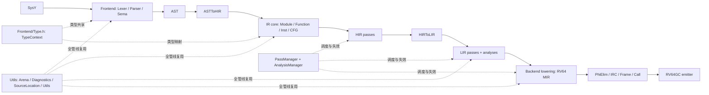

# SVM - Supportless Vectorization Machine

> Yet Another Supportless Vectorization Machine for SysY. \
~~又是一个不支持向量化的SysY编译器。~~

面向 **SysY** 语言的 RV64GC 编译器，支持标量优化，确实不支持向量化。

## 0. 如何运行

### 环境要求

- CMake 3.16 或更高版本。
- `clang` / `clang++`。`CMakeLists.txt` 会显式选择 Clang，并以 C++17、`-fno-rtti`、`-fno-exceptions` 和较严格的警告选项构建。
- Ninja 是推荐的构建器，但不是必需品。
- 编译器输出 RV64GC 汇编；运行汇编需要一个相应的交叉工具链或模拟器（这不属于本仓库的构建步骤）。

### i. 使用 CMake + Ninja（推荐）

Release 构建：

```bash
cmake -S . -B build -G Ninja -DCMAKE_BUILD_TYPE=Release
ninja -C build
```

开发使用默认的 Debug 配置，会开启各种IR验证（编译速度慢）：

```bash
cmake -S . -B build -G Ninja
ninja -C build
```

生成的可执行文件是 `build/svm`，静态库是 `build/libsvm_core.a`。

### ii. 纯 CMake

```bash
cmake -S . -B build -DCMAKE_BUILD_TYPE=Release
cmake --build build --parallel
```

### iii. 使用命令编译

> 警告：不会并行编译，通常需要几分钟。

```bash
clang++ --std=c++17 -O2 -lm \
        $(find src -name "*.cpp") \
        -I. \
        -Isrc \
        -Isrc/Utils \
        -Isrc/Frontend \
        -Isrc/IR \
        -Isrc/HIR \
        -Isrc/LIR \
        -Isrc/Backend \
        -o compiler
```

### 命令行与中间结果

基本用法：

```text
svm [options] <input-file.sy>
```

常用选项如下：

| 选项 | 输出或作用 |
| --- | --- |
| `-emit-tokens` | 输出词法单元 |
| `-emit-ast` | 输出 AST |
| `-emit-hir` | 输出结构化 HIR |
| `-emit-lir-pre` | 输出 HIRToLIR 后、优化前的 LLVM 风格文本 |
| `-emit-lir` | 输出优化后的 LLVM 风格文本 |
| `-S` / `-emit-asm` | 输出 RV64GC 汇编（默认） |
| `-O0` | 关闭优化管线，仍执行必要的 lowering 和后端 |
| `-O1` 或其他 `-O*` | 开启优化管线（默认） |
| `-time` | 打印 Pass 计时统计 |
| `-o <file>` | 指定输出文件 |
| `-h` / `-help` | 显示帮助 |

`-emit-lir*` 输出的是可运行 LLVM IR，方便使用 lli/lla 或参考编译器对拍。但内部对象**不是**完整的 LLVM IR。

## 1. 编译器架构

### 1.1 数据流


### 1.2 两条管线安排

**O0 未优化路径**：

```text
Lexer
 -> Parser / Sema / ASTToHIR
 -> HIRToLIR
 -> LowerArrayIndex
 -> LowerToRV64
 -> EliminatePhis
 -> IRCAlloc
 -> ComputeFrameLayout
 -> FixupStackOffsets
 -> LowerCallShuffles
 -> EmitAssembly
```

**O1 默认优化路径**：

```text
HIR 规范化与循环识别
 -> HIRToLIR
 -> CFG / Mem2Reg / 函数级 IPA
 -> 标量清理（若干轮）
 -> LoopSimplify / LCSSA / IndVarSimp
 -> Unswitch / RepeatReduction / Interchange
 -> UnrollAndJam / LoopUnroll
 -> LowerArrayIndex
 -> 标量地址清理 / LSR / LCSSA 析构
 -> 短路与 switch 规范化 / IfConversion / GlobalMerge
 -> LowerToRV64
 -> 机器级标量优化
 -> PhiElim / IRC / 栈帧与调用收尾
 -> EmitAssembly
```

### 1.3 各阶段主要内容

1. **词法与语法**：Lexer 将源字符映射为带 `SourceLocation` 的 Token；Parser 构造带源码范围的 AST，并在语法错误处进行部分错误恢复（插入字面量 0 节点）。
2. **语义分析**：Sema 建立作用域和符号绑定，检查类型、数组维度、函数签名、常量表达式和隐式数值转换，同时注入运行时库函数原型。
3. **ASTToHIR**：把语言语义映射到共享 `Inst` 表示。HIR 保留 `if`、`while` 等结构化控制流。
4. **HIR 优化**：在结构化表示仍然存在时做局部合并、尾递归转换、循环提升和受预算约束的模展开。
5. **HIRToLIR**：提升入口 `alloca`、物化局部初始化、展开嵌套 Region，构造普通的基本块、前驱关系和终结符；从此进入扁平 CFG。
6. **LIR 分析与优化**：在支配树、循环信息、SCEV、别名和依赖关系的支持下执行内存提升、标量化、函数级变换和循环变换。满足条件的栈标量在 `Mem2Reg` 后进入真正的 Value-SSA。
7. **LIR 到 MIR（指令选择）**：`LowerToRV64` 将目标无关的算术、访存、调用和控制流映射到 RV64GC 专用机器操作码及 ABI 伪操作。
8. **后端优化**：机器级 combine/CSE/peephole 后消解 Phi，执行迭代寄存器合并（IRC），计算栈帧，修正栈偏移，展开调用参数搬运，最后发射汇编。

## 2. 模块划分

### 2.1 模块协作图



### 2.2 目录职责

| 目录 | 主要职责 | 关键对象或文件 |
| --- | --- | --- |
| `src/Frontend` | 词法、语法、语义和 AST | `Lexer`, `Parser`, `AST`, `Sema` |
| `src/Frontend/Type.h` | 源语言类型的规范化与缓存 | `TypeContext`, `ArrayType`, `FunctionType` |
| `src/HIR` | AST 降级和结构化控制流上的早期变换 | `ASTToHIR`, `HIRInstCombine`, `RaiseToFor`, `TCO` |
| `src/IR` | 三个 IR 阶段共用的节点、CFG、Use 链、打印器和 Pass 框架 | `IR.h`, `IRBuilder`, `CFGEditor`, `PassManager` |
| `src/LIR` | 扁平 CFG、SSA、静态分析和中端优化 | `Analysis.h`, `SCEV`, `Alias`, `Dependence`, 循环与标量 Pass |
| `src/Backend` | RV64GC 机器 IR、寄存器分配、栈帧、调用约定和汇编 | `Lower`, `IRC`, `PhiElim`, `FrameLayout`, `EmitRV64` |
| `src/Utils` | 全管线基础设施 | `Arena`, `DiagnosticEngine`, `SourceLocation`, `Utils` |

### 2.3 公共组件

- **`Utils.h`**：统一整数宽度和 i32 辅助函数、位模式转换、断言和小型工具函数。规避宿主 C++ 的有符号溢出规则。
- **`Arena.h`**：类似 BumpPtrAllocator，存储 Token、AST、字符串、HIR/LIR/MIR `Inst` 及其 payload，避免在大量 CFG 改写中频繁 `new/delete`。注意：分析对象和缓存由 `AnalysisManager` 通过 C++ 容器/智能指针管理。`Erased` 节点不会从 Arena 中释放，后文会解释其逻辑失效语义。
- **`DiagnosticEngine.h`**：所有诊断统一经过此通道，并携带源码位置。`Note` 用于状态或调试输出，`Warn` 用于可恢复的前端问题，`Error` 表示输入或语义错误，`Fatal` 表示内部契约破坏并立即终止。~~后面写着写着并没有严格遵守这一条。~~
- **`SourceLocation.h`**：记录 offset、行、列和长度。Lexer 产生的范围会随 Token、AST、IR 指令传播，主要由 `IRBuilder` 维护，方便后端调试信息回指源程序。

## 3. 关键设计

### 3.1 前端

#### AST 与运行时类型识别

AST 使用面向对象的继承层次组织声明、表达式和语句。节点基类提供 `classof`，并配合项目自己的 `isa<T>`、`cast<T>`、`dyn_cast<T>` 实现 LLVM 风格的 RTTI。

#### 手写递归下降解析器 LL(8)

`Parser` 使用固定大小为 8 的 token lookahead 缓冲。每个语法非终结符对应一个解析函数（例如逻辑或、逻辑与、相等、关系、加法、乘法和一元表达式），错误恢复会跳过到分号、右花括号或文件末尾。

#### 类型和条件语义

`TypeContext` 的类型对象覆盖 `int`、`float`、`void`、数组/任意维数组，以及用于数组访问和函数签名的内部指针、函数类型；源码没有独立的 `bool` 类型，也没有把这些内部类型直接暴露成 C 风格指针语法。IR 类型则另有 `TY_I1`、`TY_I32`、`TY_F32`、`TY_PTR` 等机器无关枚举；二者不能混为同一个 `TypeContext`。

条件表达式在 Sema/HIR lowering 中规范化为 `i1` 谓词：

- `int` 可直接作为条件；
- `float` 按与 `0.0f` 的不等关系转成真假；
- 比较、逻辑非和控制流分支的结果使用 `TY_I1`；
- 若 `i1` 需要进入数值上下文，会显式用 `zext` 等转换，而不是把源码类型系统改成“bool 可任意参与算术”。

因此，更准确的表述是“IR 有 `i1` 谓词值，源语言条件被统一降低为 `i1`”，而不是“SysY 的 bool 和 int/float 完全等价”。

#### 与标准SysY的语言差异（超集）

1. **允许函数声明**：`int f(int x);` 可以先于函数体出现。Sema 先收集全局符号和函数签名，ASTToHIR 再注册定义/外部声明并降低函数体。~~可以用这个编译器再编译递归下降解释器了~~
2. **条件入口更宽**：Parser实现以表达式值经过语义归一化的方式构造条件，没有额外制造一个源码级 `Cond` 节点；这改变的是前端接受和降级到IR的行为，但 `i1` 依旧**不是**普通算术类型。

支持函数声明意味着调用图不是简单 DAG。CallGraph 使用了 Tarjan 的强连通分量（SCC），过程间分析会在递归 SCC 内求解。

### 3.2 统一的 HIR / LIR / MIR

#### 单一胖节点表示

`src/IR/IR.h` 中的 `Inst` 同时承载 HIR、LIR 和 MIR。每个节点包含：

- `OpCode`、结果 `IRType` 和最多两个内嵌/可扩展的操作数；
- 操作码相关的 `union` payload（立即数、内存描述、数组形状、调用信息、跳转目标等）；
- `Use` 链、所属基本块、源码位置和稳定 ID；
- 在 MIR 阶段使用的虚拟寄存器与机器元数据。

操作数直接是产生该值的 `Inst*`。因此，指令本身就是一个 SSA-like 值身份，Use 链天然表达 def-use 关系，并由 `setArg`、RAUW、删除等 IR 编辑操作增量维护。它不是独立的 AnalysisManager 结果。

阶段由两层枚举标记：

```text
IRPhase = HIR | LIR | MIR
MIRPhase = NotMIR | SSA | OutOfSSA | PostRegAlloc | Emittable
```

IR 的标量类型包括 `void`、`i1`、`i32`、`f32`、指针；`i64` 仅用于机器地址运算，`f64` 仅用于变参提升ABI要求。

#### 容器层次与 CFG 不变量

```text
Module -> Function -> Region -> BasicBlock -> Inst
```

注意：HIR 的 `if`、`while`、`for` 指令可以拥有嵌套 Region；LIR/MIR 顶层 Region 则是扁平 CFG。BasicBlock 分开维护 Phi 链和普通指令链，并和以下三类约定保持同步：

```text
terminator successor slots
        <-> BasicBlock predecessors
        <-> Phi incoming blocks / incoming values
```

`CFGEditor` 封装 critical-edge split、块拆分、边重定向和块合并，避免优化 Pass 只改终结符而忘记更新 Phi。合并路径时，如果 incoming 值不相同，会保留或新建 Phi，而不是用布局上的“看起来相同”替代语义。

#### HIR：结构化控制流优先

HIR 初衷参考了 [MLIR SCF dialect](https://mlir.llvm.org/docs/Dialects/SCFDialect/) 的结构化控制流，也参考了往届 SysY 项目的实践（[AdUhTkJm/sysy-competition](https://github.com/AdUhTkJm/sysy-competition)）。`OP_IF`、`OP_WHILE`、`OP_FOR` 直接携带 Region，`OP_YIELD`、`OP_BREAK`、`OP_CONTINUE` 描述 Region 的控制流出口。

这个层次让前端不必一开始就手工拼接所有基本块，且 `RaiseToFor` 能保留循环形状并识别归纳变量。但 HIR 仍是内存语义优先的表示，是对 `alloca/load/store`做SSA（有读写语义），**没有** Value-SSA。也就是说，HIR 中的 `Inst*` 有值身份，不认为已经完成 SSA 构造。

`OP_FOR` 只表达受约束的仿射归纳变量循环：`iv`、边界和步长满足方向契约。HIRToLIR的 expandFor() 将它直接发射为旋转自然循环（preheader/header/body/latch/exit），因此后续不需要再单独实现一个 LoopRotate 来修正。

#### LIR：扁平 CFG

HIRToLIR 会：

1. 将入口 `alloca` 和局部初始化锚点整理到合法位置；
2. 把嵌套 Region 展平成基本块和终结符；
3. 将 `yield` 转成跳转，将 `break/continue` 连接到相应出口/回边；
4. 重建前驱数组、Phi incoming 和 Use 链，并标记函数进入 `IRPhase::LIR`。

LIR 的操作码接近 LLVM IR 子集：有 `load/store`、`br/jmp`、`phi`、比较、调用和地址运算，但内部仍是 SVM 的 `Inst`。`Mem2Reg` 使用支配关系和 Phi 插入把满足条件的标量内存对象提升为 Value-SSA；有逃逸、地址取用或复杂数组访问的对象会保留内存语义。

`OP_ARRAYIDX` 是 typed-GEP 风格的多维地址表达式，payload 保留 rank、物理维度和元素类型。核心作用是保留所有下标，便于依赖分析和循环变换。

数组类型还区分**逻辑形状**和**物理形状**：这是一个脏HACK！`TypeContext` 保存源程序维度，`ArrayType::physicalOffset` 按物理 stride 计算存储偏移；当维度 `>= 128` 且恰为 `128` 的倍数时，`paddedArrayDim` 会额外插入 16 个元素（Array Padding Hack）。所以 `OP_ARRAYIDX` 的 payload 必须携带物理维度，而边界检查和源码语义仍以逻辑维度为准。

#### MIR：专门面向RV64GC

`LowerToRV64` 后的 MIR 专门为 RV64GC 设计：`MOP_ADDW`、`MOP_MULW`、`MOP_FLW`、`MOP_FADD_S`、`MOP_COPY`、`MOP_LI`、`MOP_LA`、栈帧伪操作和调用约定信息都直接绑定目标机特性。Lowering 尽可能原地替换 opcode（例如 `OP_MUL -> MOP_MULW`），以复用节点身份和事实元数据；需要物化常量、全局地址或 Undef 时才在使用点新建机器节点。

这里有一个一项工程权衡~~设计失败~~：统一节点降低了 lowering 和 Use 链维护成本，但后端必须额外处理Phi降级后的多定义、物理寄存器哨兵和栈伪操作等非 LLVM-SSA 形态。

#### 例子：结构化循环的降级

原程序

```C
int add(int x, float y) {
  int times = y, res = 0;
  while (times > 0) {
    res = res + x;
    times = times - 1;
  }
  return res;
}
int mul(int x, float y) {
  int res = 0;
  while (x > 0) {
    res = add(res, y);
    x = x - 1;
  }
  return res;
}
int main() {
  int a = getint();
  float b = getfloat();
  return mul(a, b);
}
```

HIR 保留循环边界和 Region：

```LLVM
define i32 @add(i32 %arg0, float %arg1) {
bb0:
  %v0 = alloca i32  ; [1] int add(int x, float y)
  store i32 %arg0, ptr %v0
  %v1 = alloca float
  store float %arg1, ptr %v1
  %v2 = alloca i32  ; [2] int times = y, res = 0;
  %v3 = load float, ptr %v1
  %v4 = fptosi float %v3 to i32
  store i32 %v4, ptr %v2
  %v5 = alloca i32
  store i32 0, ptr %v5
  hir.for i32 0, i32 -1, ptr %v2 {  ; [3] while (times > 0)
    bb1:
      %v6 = load i32, ptr %v5  ; [4] res = res + x;
      %v7 = load i32, ptr %v0
      %v8 = add i32 %v6, %v7
      store i32 %v8, ptr %v5
      hir.yield  ; [5] times = times - 1;
  }
  %v9 = load i32, ptr %v5  ; [7] return res;
  ret i32 %v9
}

define i32 @mul(i32 %arg0, float %arg1) {
bb0:
  %v0 = alloca i32  ; [9] int mul(int x, float y)
  store i32 %arg0, ptr %v0
  %v1 = alloca float
  store float %arg1, ptr %v1
  %v2 = alloca i32  ; [10] int res = 0;
  store i32 0, ptr %v2
  hir.for i32 0, i32 -1, ptr %v0 {  ; [11] while (x > 0)
    bb1:
      %v3 = load i32, ptr %v2  ; [12] res = add(res, y);
      %v4 = load float, ptr %v1
      %v5 = call i32 @add(i32 %v3, float %v4)
      store i32 %v5, ptr %v2
      hir.yield  ; [13] x = x - 1;
  }
  %v6 = load i32, ptr %v2  ; [15] return res;
  ret i32 %v6
}

define i32 @main() {
bb0:
  %v0 = alloca i32  ; [18] int a = getint();
  %v1 = call i32 @getint()
  store i32 %v1, ptr %v0
  %v2 = alloca float  ; [19] float b = getfloat();
  %v3 = call float @getfloat()
  store float %v3, ptr %v2
  %v4 = load i32, ptr %v0  ; [20] return mul(a, b);
  %v5 = load float, ptr %v2
  %v6 = call i32 @mul(i32 %v4, float %v5)
  ret i32 %v6
}
```

LIR 展平后，循环条件、回边和退出边显式存在：

```LLVM
define i32 @mul(i32 %arg0, float %arg1) {
bb0:
  %v0 = alloca i32  ; [10] int res = 0;
  %v1 = alloca float  ; [9] int mul(int x, float y)
  %v2 = alloca i32
  store i32 %arg0, ptr %v2
  store float %arg1, ptr %v1
  store i32 0, ptr %v0  ; [10] int res = 0;
  br label %bb1  ; [11] while (x > 0)
bb1:
  %v3 = load i32, ptr %v2
  %v4 = icmp sgt i32 %v3, 0
  br i1 %v4, label %bb2, label %bb4
bb2:
  %v5 = load i32, ptr %v0  ; [12] res = add(res, y);
  %v6 = load float, ptr %v1
  %v7 = call i32 @add(i32 %v5, float %v6)
  store i32 %v7, ptr %v0
  br label %bb3  ; [13] x = x - 1;
bb3:
  %v8 = load i32, ptr %v2  ; [11] while (x > 0)
  %v9 = add i32 %v8, -1
  store i32 %v9, ptr %v2
  %v10 = icmp sgt i32 %v9, 0
  br i1 %v10, label %bb2, label %bb4
bb4:
  %v11 = load i32, ptr %v0  ; [15] return res;
  ret i32 %v11
}
```

经过 `Mem2Reg` 后，`i` 和 `s` 若未逃逸，会由 Phi 和 SSA 值表示；这一步才是通常意义上的可变标量 Value-SSA。

### 3.3 `Undef` 与 `Erased`：两个特殊状态
